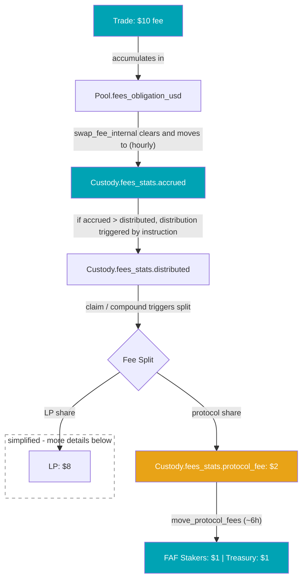

My ambition is to understand how value is generated for investors in Solana DeFi protocols. For Flash.Trade, I traced every fee-related USDC atom on-chain to map out how trading fees reach FAF stakers. This article documents the complete journey and shares what I found along the way, which partially surprised me.

<div className="note-small" style={{fontSize: '0.85em'}}>

:::note

- This article reflects my personal understanding of Flash.Trade's on-chain mechanics, derived entirely from observing on-chain state and transaction data. I have no access to Flash.Trade's source code. It may not be completely correct, but it summarizes what I learned from tracing the fee flow on-chain.
- Flash.Trade recently renamed their on-chain instructions and account fields from camelCase to snake_case (e.g. `SwapFeeInternal` became `swap_fee_internal`). I use the new snake_case names throughout this article.
- The mechanisms described below reflect the current on-chain implementation. Earlier versions worked differently (e.g. collateral-denominated vs. USD-denominated fee accrual).

:::

</div>

## Where Does Your USDC Come From?

You stake FAF. Every day, USDC appears on your [Rewards Page](https://www.flash.trade/token). But where does it actually come from? And how much of each trading fee ends up in your wallet?

I built reconciliation tools that trace every USDC atom through Flash.Trade's on-chain fee pipeline. Here is what I found.

## The $10 Journey

Before diving into on-chain details, here is a simplified thought exercise with round numbers. Fee shares and splits below do not reflect the exact on-chain situation. More precise mechanics follow in the next section.

Let's say a trader opens a $1,000 leveraged FARTCOIN position on the Trump.1 pool (which is the FARTCOIN pool, it has not been renamed on-chain), paying a **$10 fee**. Here is the high-level path that fee takes before a portion reaches you via FAF staking rewards:


<div style={{float: 'right', width: '40%', marginLeft: '1.5rem', marginBottom: '1rem'}}>



</div>

<ol>
<li><strong>Fee generation:</strong> The $10 entry fee accumulates on the Trump.1 <a href="https://solscan.io/account/Crk3yzGpPCt9thXmV9wCkBM9nBq8EHhBct71ArkKY9wA#accountData">Pool account</a> in a field called <code>fees_obligation_usd</code>. It sits there until the next consolidation run.</li>
<li><strong>Hourly consolidation:</strong> Roughly once per hour and per pool, a <code>swap_fee_internal</code> instruction moves the $10 from the Pool into the reward <a href="https://solscan.io/account/B1b3WnCbwrQC8yk6o5rVLGGJFD7BdQBLyaWsRw4Lqgp2#accountData">Custody account</a> (<code>fees_stats.accrued</code>). In the early days there was one <code>swap_fee_internal</code> per collateral type; now all fees accrue in USD, so there is one per pool per hour.</li>
<li><strong>Distribution trigger:</strong> Accrued fees need to be committed/distributed to liquidity providers (LPs). When certain on-chain events fire (such as <code>refresh_stake</code> or <code>compounding_fees</code>), the pool's reward-per-LP-staked counter (rPLS) increments and <code>distributed</code> is raised to match <code>accrued</code>. The rPLS increase equals the not-yet-distributed fees (i.e., the then delta between <code>accrued</code> and <code>distributed</code>). But nothing lands in anyone's wallet yet.</li>
<li><strong>Fee split:</strong> When staker rewards are settled via the twice-daily <code>refresh_stake</code> bursts (midnight and noon UTC), manual <code>collect_stake_fees</code> claims, or <code>compounding_fees</code> the gross amount is split. With Trump.1's [80/20 fee share](https://docs.flash.trade/flash-trade/flash-trade-protocol/technical-architecture/fee-distribution): $8 goes to the LP, $2 goes to the protocol. The $2 is booked to <code>fees_stats.protocol_fee</code>. In practice the effective protocol share might be lower (see below).</li>
<li><strong>The sweep:</strong> Every ~6 hours, <code>move_protocol_fees</code> sweeps accumulated protocol fees and splits them 50/50: <strong>$1 to FAF stakers</strong>, $1 to the protocol treasury.</li>
</ol>

<div style={{clear: 'both'}} />


## Under the Hood: Five Steps in Detail

This section examines each step with on-chain field names, formulas, and example transactions from the Trump.1 pool on December 26, 2025.

### Step 1: Fee Generation

Every trading instruction on Flash.Trade generates a fee. The fee-bearing instruction types include:

- **Position management:** `open_position`, `close_position`, `swap_and_open`, `close_and_swap`, `increase_size`, `decrease_size`
- **Order execution:** `execute_limit_order`, `execute_limit_with_swap`, `execute_trigger_order`, `execute_trigger_with_swap`
- **Liquidations:** `liquidate` (special handling, see "Fees That Never Reach Stakers" below)

Fees today are always assessed in USDC and added to the pool's `fees_obligation_usd` field on the [Pool program account](https://solscan.io/account/Crk3yzGpPCt9thXmV9wCkBM9nBq8EHhBct71ArkKY9wA#accountData). This field is a holding area: fees accumulate here until the next consolidation sweep.

**Example:** At 12:19 UTC on December 26, a trader increased their FARTCOIN position on Trump.1, generating a fee of 4,411,682 USDC atoms ($4.41). ([View on Solscan](https://solscan.io/tx/2mHZ9yY8V8VqgQ4GDir9pz4ub2sbVf9AnxBegpAW92nqfYhuCMsGZDA7aa74rvFAVCFbWMDbKhDBkXM2az3XB7bG))

### Step 2: Hourly Consolidation (`swap_fee_internal`)

Each pool has multiple Custody accounts, one per collateral type (SOL, BTC, ETH, USDC, etc.). One of them is designated the **reward custody**, defined in the Pool's on-chain account data. This is the USDC custody where all fee accounting happens: `fees_stats.accrued`, `fees_stats.distributed`, and `fees_stats.protocol_fee` all live here.

Roughly once per hour and per pool, a `swap_fee_internal` instruction consolidates accumulated fees from the Pool into the reward Custody account:

```
Custody.fees_stats.accrued  += Pool.fees_obligation_usd
Pool.fees_obligation_usd     = 0
```

This is inter-account bookkeeping within the same transaction, not a separate token transfer. The USDC tokens already sit in the Custody's token account; `swap_fee_internal` updates the accounting fields so the protocol knows fees are ready for distribution. After this, `fees_obligation_usd` is zero until new trades generate more fees.

No fee split happens at this stage. The full amount moves 1:1 into the Custody's `accrued` field, which serves as a staging area for distribution.

In the current V3 format, there is one `swap_fee_internal` per pool per hour and the fee is already in USDC. In the earlier V1/V2 format, there was one per collateral type (SOL, BTC, ETH, etc.), and the instruction converted non-USDC fees to their USDC equivalent via oracle prices.

**Example:** The 12:32 UTC `swap_fee_internal` for Trump.1 swept exactly 4,411,682 atoms (check #3.1 Inner Instruction <code>feeAmount</code>), matching the single trade from 13 minutes earlier. A perfect 1:1 transfer from Pool to Custody. ([View on Solscan](https://solscan.io/tx/3RXnFQrN7wuRMNvZERBgz3mQ51vmCuLsBKBUN7ZfKz54fqn49D1rF1G9PmuJx4UhJrdf5aQa41pwAYWRSVRr3mNp))

### Step 3: Distribution Trigger (rPLS Bump)

After non-zero `swap_fee_internal` runs, `fees_stats.accrued` is higher than `fees_stats.distributed`. This difference represents fees that are staged but not yet committed to LP token holders. If the two values are equal, there is nothing to distribute.

The commitment happens through a counter on the Pool account called `reward_per_lp_staked` (rPLS for short). When a distribution-triggering instruction executes and there are pending fees, the on-chain program:

1. Computes the pending fees: `accrued - distributed`
2. Increments `distributed` to match `accrued`
3. Computes the rPLS increment based on total LP supply

```
pending = fees_stats.accrued - fees_stats.distributed
fees_stats.distributed += pending

delta_rPLS = floor(pending * 10^6 / total_staked)
Pool.reward_per_lp_staked += delta_rPLS
```

Here `total_staked` is the sum of LP tokens across **both** the staking vault (sFLP.x) and the compounding vault (FLP.x). This is a key property: all LP tokens earn at the same rPLS rate, regardless of which vault they sit in. The different fee splits between vaults are applied later, at claim time.

**From what I see, seven instruction types trigger distribution.** Any of these, as part of their execution, cause the program to distribute pending accrued fees and update rPLS:


| Instruction                    | Purpose                                           |
| ------------------------------ | ------------------------------------------------- |
| `refresh_stake`                | Updates a staker's reward snapshot                |
| `compounding_fees`             | Mints LP tokens into the compounding vault (auto-reinvest) |
| `unstake_instant`              | Instant unstake from the staking vault            |
| `add_compounding_liquidity`    | Adds LP to the compounding vault                  |
| `remove_compounding_liquidity` | Removes LP from the compounding vault             |
| `migrate_stake`                | Migrates LP from staking to compounding vault     |
| `migrate_flp`                  | Migrates LP from compounding to staking vault     |


**Example:** At 14:02 UTC, a `compounding_fees` instruction triggered distribution on Trump.1, bumping rPLS. The compounding vault's share of 17,404,514 atoms ($17.40) was converted into newly minted LP tokens and added to the compounding vault's LP balance, making each FLP share worth more. This is the auto-compounding mechanism: rewards are reinvested as additional LP rather than paid out as USDC. ([View on Solscan](https://solscan.io/tx/4BRQqodbjQaaxWyAreWdwJuqDbVWJRCVbdJ4BL2rkUanfga5gYtpidLgzgZQU6X5ej5YHi7UgPk26wtKU5q1c7Q1))

### Step 4: Claim-Time Fee Split (Two-Vault Model)

When LP provider rewards are settled, the gross earned amount is split between the LP provider and the protocol. For the staking vault (sFLP.x), settlement happens through the twice-daily `refresh_stake` bursts (midnight and noon UTC) that process all LP stakers at once, or through manual `collect_stake_fees` claims. For the compounding vault (FLP.x), settlement happens when `compounding_fees` fires and mints new LP tokens into the vault. In both cases, the protocol's share is booked to `fees_stats.protocol_fee`. The split ratio depends on which vault the LP belongs to.

Each pool has **two vaults**, sometimes with different fee structures:


| Vault                         | Settlement triggers                    | Trump.1 LP Share | Trump.1 Protocol Share |
| ----------------------------- | -------------------------------------- | ---------------- | ---------------------- |
| **Staking vault** (sFLP.x)    | `refresh_stake`, `collect_stake_fees`, `unstake_instant` | 80%              | 20%                    |
| **Compounding vault** (FLP.x) | `compounding_fees`, vault-touch events (`add_compounding_liquidity`, `remove_compounding_liquidity`, `migrate_stake`, `migrate_flp`) | 95%              | 5%                     |


These shares are configured per pool in basis points (bps), where 10,000 bps = 100%. Trump.1's staking vault currently uses `Pool.staking_fee_share_bps = 8000` (80% to LP, 20% to protocol), reduced from 9500 in September 2025. Its compounding vault uses `Pool.compounding_stats.fee_share_bps = 9500` (95% to LP, 5% to protocol), unchanged since pool creation.

The protocol fee is computed from the LP payout:

```
protocol_fee = ceil(lp_payout * (10000 - share_bps) / share_bps)
```

For the **staking vault** (8000 bps): `ceil(lp_payout * 2000 / 8000)` = 25% of LP payout.
For the **compounding vault** (9500 bps): `ceil(lp_payout * 500 / 9500)` = 5.26% of LP payout.

The protocol fee is booked to `Custody.fees_stats.protocol_fee`, where it accumulates until the next sweep. This is where FAF staker revenue is born.

**Why this matters:** The compounding vault takes roughly **5x less** protocol fee per atom of LP reward than the staking vault (5.26% vs 25%). Since the compounding vault typically holds the majority of LP tokens, the effective protocol fee rate across the pool is significantly lower than the staking vault rate alone.

### Step 5: The Sweep (`move_protocol_fees`)

Every ~6 hours, a `move_protocol_fees` instruction collects all accumulated protocol fees from a pool's custody and splits them 50/50:

- 50% to the [FAF Staker Pool](https://solscan.io/account/9iQ9saFbTfYPHsJwnKY9BMc7xACxEL9mcHrP7qYWoTKG), distributed to FAF stakers via `collect_revenue` and `collect_stake_fees`
- 50% to the [Protocol Treasury](https://solscan.io/account/Aw9fQzvcRuSmAkjzB6BMZRvywmGrpWtCzYrD63HoguXr), retained by Flash.Trade

This 50/50 split is configured on-chain with `fee_share_bps = 5000` in the ProtocolVault and is identical across all pools.

**Example:** At 18:03 UTC on Dec 26, the Trump.1 `move_protocol_fees` swept 5,840,725 USDC atoms ($5.84): 2,920,362 atoms to the FAF Staker Pool, 2,920,363 atoms to the Protocol Treasury. ([View on Solscan](https://solscan.io/tx/kDDnEXanh7QescKeozcz4zTdPiWppiLe7ayKrZVBzmiBsDVnW5juLev6v4uYvQbtHdMu4mPPcmSYzbb2cbLsJPe))

## Why the Effective Fee Share is Lower Than the Docs Suggest

The [official Flash.Trade documentation](https://docs.flash.trade/flash-trade/flash-trade-protocol/technical-architecture/fee-distribution) states fixed LP/protocol splits per pool (e.g. 70/30 for Crypto.1, 80/20 for Trump.1). These numbers are accurate for the **staking vault** only. They do not account for the compounding vault, which sometimes has a higher LP share and therefore generates less protocol revenue.

Here are the actual on-chain fee splits for all active pools. Several pools had their staking vault shares changed in late September 2025 (around the program upgrade on Sep 23). Compounding vault shares have never changed since pool creation.


| Pool         | Staking Vault (LP / Protocol)              | Compounding Vault (LP / Protocol) |
| ------------ | ------------------------------------------ | --------------------------------- |
| Crypto.1     | 70% / 30%                                  | 70% / 30%                         |
| Virtual.1    | 70% / 30%                                  | 70% / 30%                         |
| Governance.1 | 70% / 30%                                  | 70% / 30%                         |
| Trump.1      | 80% / 20% <sup>1</sup>                     | 95% / 5%                          |
| Community.1  | 80% / 20% <sup>2</sup>                     | **100% / 0%**                     |
| Community.2  | 80% / 20% <sup>2</sup>                     | **100% / 0%**                     |
| Community.3  | 80% / 20% <sup>1</sup>                     | 95% / 5%                          |
| Ore.1        | 90% / 10%                                  | 90% / 10%                         |
| Remora.1     | 80% / 20% <sup>3</sup>                     | 90% / 10%                         |

<div style={{fontSize: '0.75rem', lineHeight: '1.4', color: 'var(--ifm-color-emphasis-700)'}}>

<sup>1</sup> Was 95% / 5% until Sep 23, 2025.<br/>
<sup>2</sup> Was **100% / 0%** until Sep 23, 2025, meaning zero protocol share from either vault and no FAF staker revenue from these pools before this date.<br/>
<sup>3</sup> Was 90% / 10% until ~Dec 2025.

</div>

Three patterns stand out:

1. **Equal splits** (Crypto.1, Virtual.1, Governance.1, Ore.1): Both vaults have the same rate, so the vault ratio does not affect the effective protocol share.
2. **Favorable compounding terms** (Trump.1, Community.3, Remora.1): The compounding vault takes less protocol fee, reducing the effective rate when more LP sits in the compounding vault.
3. **Zero protocol from compounding** (Community.1, Community.2): The compounding vault generates **zero** protocol fees. All protocol revenue from these pools comes from the staking vault alone.

**Real-world impact, Trump.1 on December 26, 2025:**

In a 6-hour interval on that day, the gross fees *settled* through both vaults totaled 58,238,043 atoms:

- Staking vault settled 19,525,291 atoms gross (33.5%), generating 3,905,072 atoms in protocol fees (20% rate)
- Compounding vault settled 38,712,752 atoms gross (66.5%), generating 1,935,640 atoms in protocol fees (5% rate)
- **Effective protocol fee rate for settled fees: ~10%**, half of the 20% stated in the docs
- Of that 10%, FAF stakers receive half: **~5% of gross settled fees**

Note: the 33.5/66.5 split reflects fees *settled in this interval*, not the vault LP balance ratio. The actual vault balances at that time were roughly 44% staking / 56% compounding. The ratios differ because of timing: the staking vault's noon `refresh_stake` burst captures rPLS delta accumulated since midnight, while the compounding vault's 7 `compounding_fees` events fire throughout the interval (13:02 to 18:02), capturing rPLS increments over a wider time window. Over longer periods, the settled ratio converges toward the vault balance ratio. Weekly data for Trump.1 confirms this: before the September 2025 share change, both vaults had a 5% protocol rate, and the effective rate was a steady ~5% regardless of vault balances. After the staking vault rate increased to 20%, the effective rate jumped to ~12-13%, matching the vault-balance-weighted average of the asymmetric rates.

The effective rate varies depending on how much LP sits in each vault and the per-vault fee share configuration. Both shift over time as LPs move between vaults and pool operators update share parameters.

## Fees That Never Reach Stakers

Not all on-chain fees flow to the protocol and FAF stakers. Two categories are excluded:

**LP management fees:** When liquidity providers add or remove liquidity (`add_liquidity`, `remove_liquidity`, `remove_compounding_liquidity`), they pay a small fee. These fees are retained within the pool and benefit all LP holders through increased net asset value. They do not flow to `fees_stats.accrued` and therefore never reach `move_protocol_fees`.

**Liquidation fees:** The `fee_amount` in liquidation events goes to the liquidator as an incentive, not to the protocol fee bucket.

---

## Appendix

<details>
<summary>Worked Example: Trump.1, December 26, 2025</summary>

A concrete worked example from a 6-hour interval (12:02 to 18:03 UTC) on the Trump.1 pool. All numbers are verifiable on-chain.

**Leg 1: Trading fees to `swap_fee_internal`: 100% match**

19 trading events generated 69,134,338 USDC atoms ($69.13) in fees. Six `swap_fee_internal` consolidation events ran during this interval, sweeping exactly the same total:

| Time (UTC) | SFI Amount (atoms) |
| ---------- | ------------------ |
| 12:32      | 4,411,682          |
| 13:32      | 32,661,049         |
| 14:32      | 10,856,415         |
| 15:32      | 6,501,088          |
| 16:32      | 0                  |
| 17:32      | 14,704,104         |
| **Total**  | **69,134,338**     |

The 16:32 sweep found zero pending fees because no trades occurred in the preceding hour.

Every atom from the trading events appears in the SFI sweeps. Perfect match.

**Leg 2: Protocol fees to `move_protocol_fees`: 13 atoms gap**

During this interval, 58 staker claims and 7 compounding distributions generated protocol fees:

| Fee Source                     | LP Payout      | Protocol Fee  | Count |
| ------------------------------ | -------------- | ------------- | ----- |
| Staking vault (25% rate)       | 15,620,219     | 3,905,072     | 58    |
| Compounding vault (5.26% rate) | 36,777,112     | 1,935,640     | 7     |
| **Total**                      | **52,397,331** | **5,840,712** | 65    |

The `move_protocol_fees` at 18:03 UTC swept **5,840,725** atoms ([View on Solscan](https://solscan.io/tx/kDDnEXanh7QescKeozcz4zTdPiWppiLe7ayKrZVBzmiBsDVnW5juLev6v4uYvQbtHdMu4mPPcmSYzbb2cbLsJPe)). That is 13 atoms more than the 5,840,712 atoms I computed from individual events. The 13-atom difference should be explainable from rounding in the on-chain integer arithmetic across 65 protocol fee calculations.

**Where the $69.13 went**

| Destination                            | Amount     | Share    |
| -------------------------------------- | ---------- | -------- |
| LP providers (staking + compounding)   | $52.39     | 75.8%    |
| Protocol fees                          | $5.84      | 8.4%     |
| &emsp;FAF stakers (50%)               | $2.92      |          |
| &emsp;Treasury (50%)                  | $2.92      |          |
| Fees not yet distributed (pool buffer) | $10.90     | 15.8%    |
| **Total**                              | **$69.13** | **100%** |

The $10.90 in the pool buffer represents fees that were swept by `swap_fee_internal` but not yet committed through an rPLS bump by the time of the `move_protocol_fees` sweep. These fees are distributed in subsequent intervals, nothing is lost.

</details>

<details>
<summary>How I Verified the Fee Flow</summary>

I built a 4-layer reconciliation engine that independently verifies each stage of the fee flow:

1. **Gross-Fee Ledger:** Accumulates trading fees from `swap_fee_internal` events and compares against individual trade fees
2. **Distribution Ledger:** Tracks rPLS bumps and verifies that pending fees are distributed correctly
3. **Protocol-Fee Ledger:** Books protocol fees from staker claims, compounding distributions, and vault-touch events
4. **MPF Reconciliation:** Compares the sum of booked protocol fees against the actual `move_protocol_fees` on-chain sweep

The result: near-perfect reconciliation for most intervals across all pools and all dates in my dataset. Typical gaps are single/triple-digit atoms from integer rounding. A small number of intervals have larger gaps attributable to on-chain edge cases I cannot model, but these do not affect the overall picture.

</details>