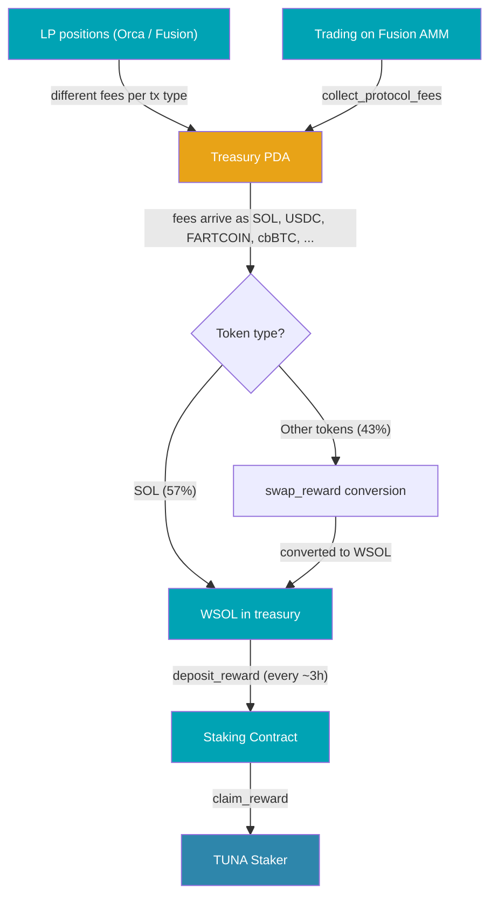
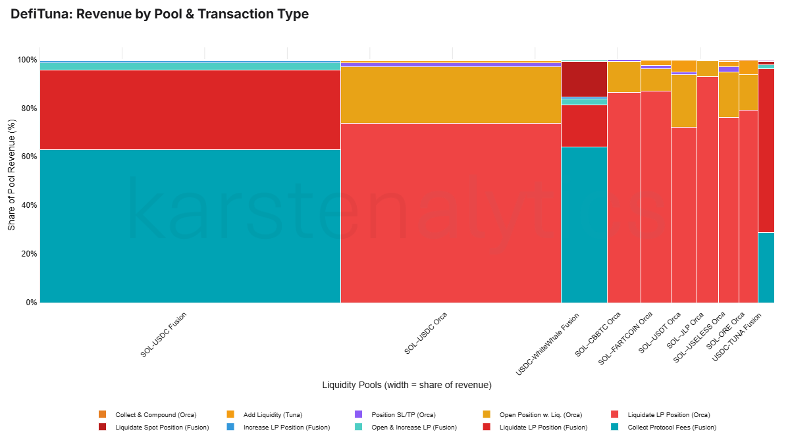

DefiTuna was the first protocol I started tracking on karstenalytics. The [dashboards](/analysis/defituna/overview) have been live for a while, but I never wrote the companion article explaining how the fee pipeline actually works. After publishing the [Flash.Trade fee flow](/articles/2026/03/05/how-flash-trade-fees-reach-faf-stakers) deep dive, it was time to give DefiTuna the same treatment. The fee journey turned out to be surprisingly different: fees arrive in dozens of different tokens from pools across two AMMs, all of which need to be converted to SOL before stakers see a single lamport.

<div className="note-small" style={{fontSize: '0.85em'}}>

:::note

- Everything in this article comes from observing on-chain state and transaction data. I have no access to DefiTuna's source code, so the behavioral explanations below are inferences from those traces.
- The mechanics described below are based on on-chain activity observed through March 15, 2026.

:::

</div>

<!-- truncate -->

## Where Does Your SOL Come From?

So, you stake TUNA. That's good for you, I would say! Periodically, SOL appears on your [Stake $TUNA](https://defituna.com/stake) page, ready to claim or compound. But where does it actually come from? And how does a fee paid in FARTCOIN on an Orca whirlpool end up as SOL in your staking position?

I wanted to verify that fees are properly transformed into staker revenue, with nothing materially lost along the way. After tracing every transaction in my dataset, I can confirm the pipeline is accurate within the 0.01 SOL tolerance used in this analytics system. This article walks through how it works.

## The Fee-to-Revenue Journey

The diagram on the right shows the high-level path. The first thing to notice: unlike Flash.Trade, which accumulates fees in internal on-chain accounting fields and periodically sweeps them through multiple stages, DefiTuna routes every fee directly to the [treasury PDA](https://solscan.io/account/G9XfJoY81n8A9bZKaJFhJYomRrcvFkuJ22em2g8rZuCh) within the same transaction that generates it. No staging areas, no hourly consolidation. But the fee arrives in whatever tokens the pool trades in, which creates a conversion challenge.

<div style={{float: 'right', width: '45%', marginLeft: '1.5rem', marginBottom: '1rem'}}>



</div>

Let's trace a single fee with round numbers. A user deposits 10 SOL as collateral and borrows 20 SOL to open a 3x leveraged LP position on the SOL-USDC Orca whirlpool. DefiTuna's docs describe the protocol fee as a percentage of the borrowed funds amount. At the most common observed rate in my dataset, 10 bps (0.10%), that is a fee of **0.02 SOL of value**. Because this is a two-token pool, the fee reaches the treasury split across both tokens: roughly 0.01 SOL and another 0.01 SOL-equivalent in USDC.

The 0.01 SOL is ready for distribution to stakers immediately; it is already in the right denomination. (Technically, the treasury holds it as WSOL, SOL wrapped as an SPL token so it can be handled by the token program like any other token. This article uses "SOL" when talking about value and "WSOL" in technical contexts where the wrapped form matters.) The USDC sits in the treasury's USDC token account, accumulating alongside USDC from dozens of other transactions, until a `swap_reward` instruction converts the batch to SOL. Three hours later, a `deposit_reward` instruction deposits all accumulated SOL into the [staking contract](https://solscan.io/account/tUnst2Y2sbmgSgARBpSBZhqPzpoy2iUsdCwb5ToYVJa), where it becomes claimable by TUNA stakers proportional to their stake.

That is the simple case. Now imagine the same fee from a SOL-FARTCOIN pool: half arrives as FARTCOIN. Or from a USDC-WhiteWhale pool: it arrives as USDC and WhiteWhale tokens. Across more than 50 pools and more than 30 different tokens, the treasury is constantly collecting, converting, and depositing.

All treasury revenue is distributed through the staking contract. There is no on-chain split like Flash.Trade's 50/50 split between stakers and a separate protocol-treasury leg; wallets controlled by the team appear to earn through the same staking mechanism as other TUNA holders.

<div style={{clear: 'both'}} />

The following sections zoom into each stage of this journey: how fees are charged, how non-SOL tokens are converted, and how SOL reaches stakers.

### The Fee Model

DefiTuna is a **leveraged liquidity provision protocol**. Users deposit collateral, borrow additional capital from DefiTuna's lending pools, and deploy the combined amount as concentrated liquidity on Orca Whirlpools or Fusion AMM pools (for LP positions), or as directional bets (for leveraged spot positions).

An important detail: [Fusion AMM](https://fusionamm.com/) is not a third-party AMM. It is built by the DefiTuna team, a hybrid CLMM + on-chain orderbook. Fusion AMM is the underlying trading venue, while DefiTuna is the lending and leverage layer on top. Revenue from both shows up in the same treasury-to-staking pipeline traced here.

DefiTuna charges a **protocol fee** on position management (opening, compounding, trigger order execution) and a **liquidation fee** (10% of remaining funds after debt repayment) on liquidated positions. The docs illustrate the protocol fee as 0.05% of borrowed funds, but from analyzing 240,000+ scanned treasury transactions I found the most common observed tier is 10 bps (0.10%), with other pools at 5 or 3 bps.

Lenders who supply capital to the lending pools earn borrowing interest, but the **lending protocol fee is currently 0%**: lenders receive 100% of borrower interest, and none of it flows to the treasury.

### The `swap_reward` Conversion Pipeline

Non-SOL tokens accumulate in the treasury's associated token accounts (ATAs) until a `swap_reward` instruction converts them to WSOL. DefiTuna uses several variants depending on the token and the routing path:

| Instruction | Route |
|-------------|-------|
| `swap_reward_orca` | Single-hop swap via Orca Whirlpool |
| `swap_reward_fusion` | Single-hop swap via Fusion AMM |
| `swap_reward_two_hop_orca` | Two-hop swap via Orca (e.g. FARTCOIN -> USDC -> SOL) |
| `swap_reward_two_hop_fusion` | Two-hop swap via Fusion |

The conversions are part of the same keeper bot cycle as `deposit_reward`. Every ~3 hours, the bot converts whatever non-SOL tokens have accumulated -- down to dust amounts -- then decides whether to deposit based on the total WSOL balance (see [below](#every-3-hours-like-clockwork)). USDC appears in 96% of conversion cycles because it accumulates fast enough to have a balance every 3 hours. Niche tokens like cbBTC (present in about 6% of cycles) may go days between conversions, not because the bot waits for a minimum balance, but because it takes that long for any fees in that token to appear.

#### The Attribution Puzzle

`swap_reward` transactions create an accounting challenge. When a conversion turns 100 USDC into 0.7 SOL, that 0.7 SOL is not new revenue. It is the SOL-equivalent of USDC fees that were already earned by earlier transactions. If you count both the original USDC inflow and the `swap_reward` SOL output, you double-count.

I solve this by tracking a ledger of pending ATA balances per mint and per originating transaction type. When a `swap_reward` fires, its SOL output is attributed proportionally back to the original transactions that earned the ATA tokens. The conversion itself is never counted as new revenue.

### The `deposit_reward` Cycle

Once fees have been converted to SOL, a `deposit_reward` instruction deposits the accumulated WSOL into the [TUNA staking contract](https://solscan.io/account/tUnst2Y2sbmgSgARBpSBZhqPzpoy2iUsdCwb5ToYVJa). The instruction logs a `total_unclaimed_reward` value (in lamports) showing the cumulative SOL available for stakers to claim.

#### Every 3 hours, like clockwork

I analyzed all 1,291 `deposit_reward` events in my dataset to understand the cadence and determine what triggers a cycle.

**The base interval is roughly 3 hours.** During high-volume periods like October 2025, events fire at near-steady 3-hour intervals. On October 1, the first four events landed at 01:49, 04:50, 07:52, and 10:54 UTC. The gaps are 3h01m, 3h02m, and 3h02m; not exactly 3 hours, but close. The small drift that accumulates over successive cycles suggests a timer-based mechanism rather than a fixed cron schedule.

**The trigger threshold is 1.0 SOL.** When revenue is low, cycles get skipped. By tracking WSOL inflows to the treasury between consecutive deposits, I found a sharp cutoff: across all 1,291 events, not a single normal deposit fired with less than 1.0 SOL accumulated. The smallest deposits barely cleared the line:

| Event date | Gap | WSOL collected |
|------------|-----|---------------|
| 2026-02-10 | 6.1h | 1.003 SOL |
| 2025-11-27 | 3.0h | 1.005 SOL |
| 2026-01-27 | 6.0h | 1.006 SOL |
| 2026-01-04 | 3.0h | 1.007 SOL |

The tiny overshoot above 1.0 (3,000,000 to 8,000,000 lamports) is revenue that trickled in between the balance check and the deposit transaction landing on-chain. The threshold itself is almost certainly exactly 1,000,000,000 lamports.

**During low-volume periods, skipped cycles become common.** In February 2026, only about 37% of inter-deposit gaps were simple ~3-hour intervals. Over the full dataset, the 1,290 gaps between consecutive deposits break down as:

| Gap | Count | Share | Meaning |
|-----|-------|-------|---------|
| ~3 hours | 983 | 76.2% | >= 1 SOL available, deposit fires |
| ~6 hours | 227 | 17.6% | One cycle skipped |
| ~9 hours | 53 | 4.1% | Two cycles skipped |
| ~12+ hours | 27 | 2.1% | Three or more cycles skipped |

The behavioral model: every ~3 hours, the keeper checks the treasury's WSOL balance. If >= 1.0 SOL is available, it fires `deposit_reward` to sweep the full balance into the staking contract. If not, it waits for the next cycle.


## What Flows Through the Pipeline

Now that the mechanics are clear, let's look at what actually flowed through this pipeline. Over the 235 days in my dataset (July 24, 2025 to March 15, 2026), the treasury collected **8,381 SOL**.

### Revenue by Source

| Source | Revenue Type | SOL | Share | What generates it |
|--------|--------------|-----|-------|-------------------|
| Orca | Leveraged LP | 4,268 | 50.9% | Position opens, closes, liquidations, compounding |
| Orca | Direct transfers | 146 | 1.7% | Revenue collected before the current fee system was in place |
| Fusion | AMM trading fees | 2,544 | 30.4% | `collect_protocol_fees` sweeps from Fusion pool accounts |
| Fusion | Leveraged LP | 1,339 | 16.0% | Position opens, closes, liquidations, compounding |
| Fusion | Spot positions | 84 | 1.0% | Leveraged spot trading |
| | **Total** | **8,381** | **100%** | |

The **Fusion AMM trading fees** deserve a note: `collect_protocol_fees` is a periodic sweep of accumulated swap fees from Fusion pool accounts. Multiple types of trading activity on Fusion contribute to these fees, but the on-chain instruction aggregates them into a single collection event. Breaking down what trading activity sits behind each sweep would require caching all Fusion pool transactions, not just treasury transactions, which my pipeline currently does not do. There is also a difference in how the two AMMs surface fees: on Orca, fees are collected as part of position management transactions (open, close, compound), while on Fusion, the dedicated `collect_protocol_fees` sweep is the largest single revenue category.

On both Orca and Fusion, **liquidations account for a significant share of LP revenue**. This is inherent to leveraged concentrated liquidity: when prices move outside a position's range, the position stops earning fees and becomes increasingly exposed to impermanent loss. With leverage amplifying the losses, positions can hit their [liquidation threshold](https://docs.defituna.com/dive-into-defituna/provide-liquidity/platform-info/liquidations) during volatile moves. The liquidation fee is 10% of the remaining position value after debt repayment, which is substantially larger per event than the protocol fee (typically 10 bps) charged at position opening.

This also means treasury revenue is sensitive to market volatility. During volatile periods, liquidation volume spikes and so does revenue. During low-volatility regimes, such as early March 2026, liquidations dry up and revenue drops significantly.

Explore the full breakdown on the [revenue by type dashboard](/analysis/defituna/fees-revenue/by-type).

### Revenue by Pool

| Pool | Revenue (SOL) | Share |
|------|--------------|-------|
| Fusion SOL-USDC | 3,053 | 36.4% |
| Orca SOL-USDC | 2,237 | 26.7% |
| Fusion USDC-WhiteWhale | 469 | 5.6% |
| Orca SOL-CBBTC | 344 | 4.1% |
| Orca SOL-FARTCOIN | 303 | 3.6% |
| Other | 1,974 | 23.6% |

SOL-USDC pools on both AMMs account for 63% of revenue, but the remaining 37% comes from a diverse long tail of token pairs. This creates the accounting challenge described in the `swap_reward` section: when DefiTuna collects a protocol fee from the SOL-FARTCOIN pool, part of that fee arrives as FARTCOIN tokens that must be converted to SOL before distribution.

The treasury receives fees in more than 30 different token mints: 57% as direct SOL (ready immediately), 24% as USDC, and the remaining 18% spread across FARTCOIN, WhiteWhale, cbBTC, TUNA, ORE, BONK, and many others. Everything except SOL must pass through the `swap_reward` conversion pipeline before stakers see it.

Explore the full breakdown on the [revenue by pool dashboard](/analysis/defituna/fees-revenue/by-pool).

### The Liquidation Dependency

The data above reveals a structural pattern: DefiTuna's revenue is heavily dependent on liquidations. The protocol fee on position opens is small (typically 10 bps), while the liquidation fee (10% of remaining value) generates far more per event.

How much more? Counting all 190,000 revenue-generating transactions in the dataset:

| Category | Transactions | % of Txs | Revenue (SOL) | % of Revenue |
|---|---:|---:|---:|---:|
| **Liquidations** | 8,904 | 4.7% | 4,467 | 53.3% |
| Fusion trading fees | 7,103 | 3.7% | 2,544 | 30.4% |
| LP operations (incl. SL/TP) | 169,735 | 89.5% | 1,140 | 13.6% |
| Spot positions | 3,963 | 2.1% | 84 | 1.0% |
| Other | 3 | 0.0% | 146 | 1.7% |

Nearly 90% of all treasury transactions are routine LP operations (opens, compounds, fee collections), but they contribute just 14% of revenue. Liquidations are fewer than 5% of transactions yet account for more than half of all SOL earned. During volatile months like October 2025, liquidation-driven revenue pushed daily totals well above average. During calm stretches like early March 2026, liquidations nearly disappeared and revenue dropped to a fraction.

The chart below visualizes this, breaking down the top 10 pools by revenue (covering ~89% of total). Each column is a liquidity pool; column width reflects the pool's share of total revenue. Within each column, colored segments show transaction types, with height indicating their share of that pool's revenue. A large area means a high-revenue combination.

Red segments are liquidation fees. In the Orca SOL-USDC column, red dominates: most of that pool's revenue comes from liquidations. The Fusion SOL-USDC column tells a different story; the largest segment is `collect_protocol_fees` (teal), the periodic sweep of trading fees from the Fusion AMM. This is the revenue source that does not depend on liquidations. Across the smaller pools on the right, liquidation red is present nearly everywhere.

[](/analysis/defituna/fees-revenue/pools-vs-types)

*Interactive version: [Revenue by Pool & Transaction Type](/analysis/defituna/fees-revenue/pools-vs-types)*

A protocol that earns most of its revenue from liquidations needs volatile markets to sustain staker returns.

The DefiTuna team is actively working to change this. They plan to wind down support for Orca pools and consolidate all activity on their own Fusion AMM. That will mean a short-term revenue hit, Orca currently accounts for over 50% of total revenue. But combined with permissionless pool creation on Fusion, which is also in the pipeline, this could fundamentally shift the revenue mix. $TUNA staker revenue would become less dependent on liquidations. 

But regardless of where the fees come from or how the mix shifts, the pipeline would stay the same: fees arrive in dozens of tokens from LP positions and trading, the keeper bot converts and deposits on roughly three-hour checks, and the revenue ultimately lands in the TUNA staking contract. That is what I set out to verify, and it holds across the full history covered here. The machinery works. What flows through it is the part that will changing.

---

## Appendix

<details>
<summary>Worked Example: February 5, 2026, 04:00-07:00 UTC</summary>

A concrete 3-hour `deposit_reward` cycle traced end-to-end. This is not a cherry-picked cycle; I simply picked a random date and time window. The transactions shown in Step 1 are a sample of the dozens that occurred during this window, chosen to show the variety of fee sources. All amounts are verifiable on-chain.

**The cycle**: Between 03:58 and 06:59 UTC, the treasury processed dozens of revenue-generating transactions across multiple pools and token types. At the end of the cycle, a burst of `swap_reward` conversions and a `deposit_reward` deposited the accumulated SOL into the staking contract.

**Step 1: Fees accumulate from trading activity**

Throughout the 3-hour window, fees trickle into the treasury from position management and compounding. A few of the larger events:

| Tx | Time (UTC) | Transaction Type | SOL to treasury | Other tokens to treasury |
|----|------------|-----------------|----------------|--------------------------|
| [3ps13...WLifY](https://solscan.io/tx/3ps13XjJCiaBNV4gssH6e91X5cypoEbCDD1rAhtxfrqMDsJ8yeAYBgisk5LGQvWorngZkVDATbpGG5iAPdoWLifY) | 04:11 | Open LP position (Fusion) | 0.009 SOL | -- |
| [4BkQC...HUSc](https://solscan.io/tx/4BkQCRpw2CsEroKj1KsDnWAU6QwjD9JaWFiBZoBk3wMN5KdH7DCrA368p93BZ8Y214B6k2gjBT8hYcu9Wp8NHUSc) | 05:10 | Open position (Orca) | 0.003 SOL | 0.10 USDC |
| [5LriU...MQtv](https://solscan.io/tx/5LriUAE15onQmhVcenkeWzrTDSRoxLhW5xhWy9UHMU1mdxxzXyU3VVZgB2CemLBFvL3mt6tmxp679b7kbUycMQtv) | 05:53 | Add liquidity (Tuna) | 0.006 SOL | -- |
| [26XVa...S1bB](https://solscan.io/tx/26XVasePB1JLqUqLuYCwnhxPoQYpDTrEXuZ561VRx2bdk9rxTUjBWCELA85n3VhkFP5V1uTGUsGF3aWMWBADS1bB) | 06:08 | **Take-Profit trigger (Orca)** | **0.033 SOL** | **0.003 JUP** |
| [5Ekh8...kWiU](https://solscan.io/tx/5Ekh8doSXvaFzPeBGPwzzrWpN4HPQ9A3pVaMncGsYPqpFzepFSLyVU8uFRL9Vx8oNeJzsMbyrMnz5JoPaW3EkWiU) | 06:12 | Open position (Orca) | 0.011 SOL | 8.34 JUP |
| [25Aii...4V9](https://solscan.io/tx/25AiiEnEWJDbCjAfsjzQX4KWesonXsN5YMXJQotegTXBLNvq5DrDqug8VPs79L97zvfE2sQmin9MgFTarx8Xy4V9) | 06:27 | Open position (Orca) | 0.003 SOL | -- |

The take-profit at [06:08](https://solscan.io/tx/26XVasePB1JLqUqLuYCwnhxPoQYpDTrEXuZ561VRx2bdk9rxTUjBWCELA85n3VhkFP5V1uTGUsGF3aWMWBADS1bB) is interesting: on-chain, the program calls `LiquidateTunaLpPositionOrca`, but the logs reveal it is executing a T/P order. The transaction closes the SOL-JUP position, repays the loan, and transfers the protocol fee to the treasury, all in a single transaction.

**Step 2: Protocol fees are swept from Fusion pools**

At 06:57 UTC, four `collect_protocol_fees` instructions sweep accumulated fees from Fusion pools in rapid succession:

| Tx | Time | Pool | Token A | Token B |
|----|------|------|---------|---------|
| [3WMzC...Jre9](https://solscan.io/tx/3WMzCZRURkzGHNwmFhnvPCrJJGBVUfLMpMQaoys5BUommjrGanpnE1kPUc5rcvqY3LqLaX1NY36s1XHopdFnJre9) | 06:57:53 | SOL-USDC | 0.082 SOL | 7.17 USDC |
| [4mKYK...29Cj](https://solscan.io/tx/4mKYK6wRxFWvUWt8GAetfUXiXzdqGUKT28Yxio8rkJVD3TpoU98emKAfvbGq7rx9NEky4PJdLA5jMmrEDsm229Cj) | 06:57:56 | USDC-TUNA | 0.73 USDC | 45.79 TUNA |
| [2d9Ni...Y8mU](https://solscan.io/tx/2d9Nin2b2UQqvheNJcUMbpLcRo4mwot7XFr8NjT5ypexVkATWsR3Edxp9saYb3PGkw6AtQJQKpjRCpv8WRkDY8mU) | 06:57:58 | USDC-WhiteWhale | 1.51 USDC | 27.10 WhiteWhale |
| [25vRz...2fhy](https://solscan.io/tx/25vRz7xBejgRrH9YssQ4CafF2btQEhs6Lhp389ejAUMbUmYwPV3qJQRCsETGqiLLsppa3xLCRzoN6nyVfuQo2fhy) | 06:58:01 | USDC-PUMP | 0.26 USDC | 187.76 PUMP |

Notice the multi-token nature: the treasury now holds USDC, TUNA, WhiteWhale, and PUMP tokens that all need to be converted to SOL.

**Step 3: `swap_reward` converts everything to SOL**

Immediately after the fee sweeps, seven `swap_reward` transactions fire within 55 seconds, converting accumulated non-SOL tokens to WSOL:

| Tx | Time | Instruction | Tokens sold | SOL received |
|----|------|-------------|------------|-------------|
| [4sN6w...5V7u](https://solscan.io/tx/4sN6wuwzQY4NfvGPY5uMuyzwBp166XF7dJqMxNdPbAkDiHhyj6MvGmydxgw2fcsShgx4nij8RKEJcSZNCx5s5V7u) | 06:58:08 | `swap_reward_fusion` | 46.95 USDC | 0.521 SOL |
| [3HPwG...9DxS](https://solscan.io/tx/3HPwGqHDyUriX5aFFwbYEGuwPDP4W4iVgns45tS8wnsFdNAsdMkTnwFCN1koqJBrot2ERhCzba9CHtxWUvwr9DxS) | 06:58:28 | `swap_reward_two_hop_orca` | 0.0015 cbBTC | 1.186 SOL |
| [s5oXN...UeV](https://solscan.io/tx/s5oXNLVxAuSSmKVwGoVN4bHQGr8dSq6GUYTUip3p3fYBsnaYy4cD76BuEzWdsdieLNduWz2CTJrcW2BZb9hkUeV) | 06:58:37 | `swap_reward_fusion` | 140.72 TUNA | 0.036 SOL |
| [3o4QE...ucB](https://solscan.io/tx/3o4QE1M4JaMUdvyaQoG11EMepawJrA3Kk3doCvAjBtavsZu6ZsVMH2EGn8JZrM9KWHfeaqVGqHpo9vYXbWVfQucB) | 06:58:49 | `swap_reward_orca` | 8.34 JUP | 0.017 SOL |
| [4CFZK...1u1k](https://solscan.io/tx/4CFZKaxZ26C4yVU13KeXeDBPxuU3piftJLvk35DSa7bi1tCEJEWtHF5EaC5QkLetBdaFUQxVGwjbe7vJH7Kn1u1k) | 06:59:03 | `swap_reward_orca` | 0.0039 BTC (Wormhole) | 3.064 SOL |

The cbBTC swap uses a two-hop route (cbBTC -> USDC -> SOL via Orca), while TUNA and USDC are swapped directly on Fusion.

**Step 4: `deposit_reward` credits the staking contract**

At 06:59:48 UTC, the `deposit_reward` instruction ([Sk94i...iV8](https://solscan.io/tx/Sk94iQkDPUSzcFPADhJXTcp7EMh8KWrE1yBXCy1DEurh4ZMnbDskQYSHbtZSEe4VMdgAiU9razHY8ED2Q3T6iV8)) fires, depositing the accumulated WSOL into the TUNA staking contract. The on-chain log reads:

```
Program log: total_unclaimed_reward: 1109350827451; acc_reward_per_share: 2625355448996
```

That is 1,109.35 SOL in total unclaimed rewards across all stakers. The previous `deposit_reward` (at 03:57 UTC) logged 1,104.55 SOL, so this cycle added **4.80 SOL** to the staking pool. The 4.97 SOL collected during the cycle minus 4.80 SOL deposited leaves a 0.17 SOL difference: revenue that was still pending in the treasury when the deposit landed.

**Where the 4.97 SOL came from (this cycle)**

| Source | SOL |
|--------|-----|
| Direct WSOL from position mgmt (opens, adds, compounds) | 0.03 |
| Direct WSOL from liquidation | 0.03 |
| Direct WSOL from fee collection | 0.08 |
| `swap_reward` conversions (USDC, TUNA, cbBTC, JUP, BTC (Wormhole)) | 4.82 |
| **Total** | **4.97** |

In this cycle, about 97% of the SOL that reached stakers started as non-SOL tokens and had to be converted first.

</details>

---

*Revenue data covers July 24, 2025 through March 15, 2026 (235 days). The live version of this data is on the [DefiTuna dashboards](/analysis/defituna/overview), updated daily.*
