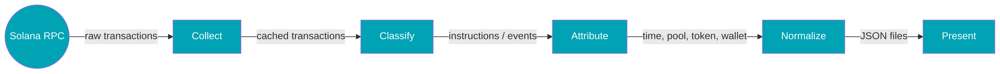
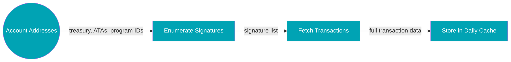
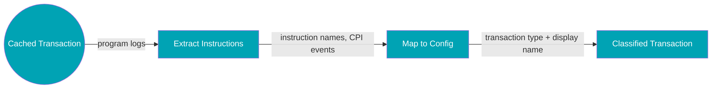
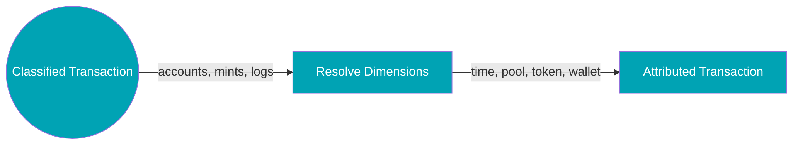
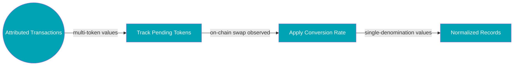
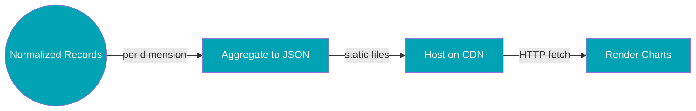

# End-to-end data pipeline

This page documents the general approach to analyzing Solana DeFi protocols through on-chain data.
For technology stack details, see [Technical Foundation](/intro/tech-setup). 

If you just want to see the numbers, feel free to skip this page.

## Overview

The data pipeline transforms raw blockchain transactions into interactive analytics through five major stages:

**Pipeline Overview:**

1. **Collect** - Enumerate transaction signatures for monitored accounts, fetch full transaction data with logs via Helius RPC, store in compressed daily cache files
2. **Classify** - Identify the instructions and events executed in each transaction by parsing program logs and decoding CPI event data
3. **Attribute** - Resolve the context for each classified transaction: E.g. when it happened (time), which pool, which token, which wallet
4. **Normalize** - Convert multi-token values (e.g. SOL, BTC, ETH, USDC) to a common base denomination using on-chain swap rates, so figures are comparable across days and tokens. Common base depends on protocol
5. **Present** - Aggregate into JSON files per dimension (by token, by pool, by type, etc.), host as static assets, render as interactive Plotly charts in the frontend

**Processing Model:**

All processing happens "offline", means once a day after midnight UTC in a separate backend repository which is not public. The frontend displays pre-computed JSON files, so page loads are fast regardless of data volume.

---

## 1. Collect

### What Gets Monitored

Which accounts get monitored depends on the analysis objective:
- **Treasury and (Stake) Pool accounts** - Where protocol revenue accumulates or protocol tokens are staked
- **Token accounts (ATAs)** - Holding protocol-relevant tokens
- **Wallet addresses** - Key addresses involved in protocol operations or vesting

The specific accounts monitored depend on the analysis objective. Revenue analysis tracks treasury addresses. Staking analysis monitors staking program interactions. Position analysis follows liquidity pool accounts.

### Data Sources

**Primary:** Helius API provides enhanced transaction data with parsed logs and token transfers, guaranteeing logMessages and consistent classification.

**Supplemental:** Protocol websites and documentation provide context like token names and pool information that I use as QA/ for benchmarking.

On-chain transactions contain a lot of information. I try to get as much information as I can out of as little transactions as possible. There are a lot of ways to slice and dice on-chain data.

### Update Cadence

Data updates run daily via automated GitHub Actions workflow in the backend repository. When analytical methods change or improve, the entire dataset is reprocessed.

---

## 2. Classify

The core objective is **identifying which instructions are being executed** in each transaction touching the accounts I monitor.

### Log-Based Classification

**Solana programs emit log messages during execution** as part of the blockchain's native logging system. These logs are not added by Helius, Solscan, or other data providers. They come directly from the on-chain programs.

The classification system:
1. **Extracts instruction names** from program logs (e.g. "Instruction: CollectFees", "Instruction: Stake")
2. **Maps instruction names** to transaction categories via a configuration file
3. **Decodes structured event data** where needed. Some protocols emit additional data through CPI events or Anchor IDL-encoded parameters that provide amounts, account details, and state changes not visible in log lines alone

### Classification Configuration

A configuration file maintains the mapping between instruction names and their meanings. This includes:
- Display names for user-facing labels (instead of technical strings)
- Categorization for grouping related transactions (there might be different instruction types I want to sum up and display as one type, or when there is instruction versioning like closePositionV1, closePositionV2)
- Revenue flags indicating which transactions generate value versus those that merely convert or move it (e.g. a certain token swap instruction might help distribute existing revenue but not create new revenue)
- Color schemes for consistent visualization (e.g. liquidations should always have a red-ish color)

When protocols introduce new transaction types, the configuration is updated with an automated first guess and historical data is reprocessed for consistency.

---

## 3. Attribute

Each classified transaction is tagged across several dimensions so the same data can be sliced in different ways:

### Attribution Dimensions
- **Token** - Which asset was involved (SOL, USDC, protocol tokens)
- **Transaction Type** - What operation occurred (fees, swaps, stakes)
- **Pool** - Which liquidity pool or program was involved
- **Wallet** - Which addresses participated/ triggered the transaction
- **Time** - When the transaction occurred

This means a single fee transaction can contribute to a "revenue by token" chart, a "revenue by pool" chart, and a "top wallets" table without any duplication or re-processing.

### Pool Identification

Pool identification uses several fallback strategies:

1. **Direct address matching** - Compares transaction account addresses against a registry of known pool addresses maintained in configuration files
2. **Alias resolution** - Maps alternative addresses (like position accounts or vault accounts) to their canonical pool IDs
3. **Token pair hints** - Uses mint addresses involved in transfers to identify pools when direct matches aren't found (e.g., a transaction involving SOL and USDC mints likely belongs to a SOL-USDC pool)

The pool registry combines manually verified entries with auto-discovered pools. When a new pool is encountered, it gets a generated label and can be promoted to the manual registry with a human-readable name.

---

## 4. Normalize

To compare and aggregate transactions involving different tokens, values are normalized to a common base denomination if required. Which denomination depends on the protocol. For example, a protocol that distributes SOL to stakers normalizes to SOL, while one that collects fees directly in USDC may need no conversion at all.

### Conversion Approach

**On-chain rates only.** I never use external price feeds. When tokens are swapped on-chain, the actual exchange rate provides precise valuation for that moment. If there are multiple swaps per day, I always take the valuation of the moment and build an average if required for reporting purposes.

**Same-day pricing.** Conversion rates are applied only to transactions occurring on the same day, ensuring historical values are never retroactively adjusted based on future price changes.

*Example:* If a treasury receives 100 USDC as fees on Day 1 and swaps it for 0.5 SOL to distribute to stakers on Day 5, Day 1 revenue is recorded as 100 USDC (unconverted). On Day 5, the swap reveals the rate and the converted value is recorded then. Day 1's record remains unchanged, preserving the actual state of the treasury on that day.

**Native token handling.** Wrapped versions of native tokens (like WSOL) convert 1:1 with their native counterparts.

### Pending Conversions

This applies when a protocol collects fees in multiple tokens but distributes rewards in a single denomination. Tokens not yet converted remain tracked in their native denomination but are excluded from normalized totals until conversion occurs on-chain. This ensures reported values reflect **realized amounts** rather than estimates.

Not every protocol requires this step. Some collect fees directly in a single token, making conversion unnecessary. Others accumulate diverse tokens (USDC, ETH, cbBTC, etc.) that are periodically swapped to a distribution token, making pending-conversion tracking essential.

---

## 5. Present

Each protocol's normalized data is aggregated into dimension-specific JSON files (e.g. `daily_by_token.json`, `daily_by_pool.json`, `daily_by_type.json`).

### Static architecture

The frontend is a Docusaurus site. All JSON files live in `/static/data/` and are served as plain files, so there is no server-side processing or database involved. This keeps hosting simple and page loads fast.

### Rendering

React components fetch the JSON files on page load and render them as interactive Plotly charts. Charts support zooming, filtering by clicking segments, and toggling between light/dark mode.

A manifest timestamp in the site header indicates when data was last updated.

---

## Data Quality

**For detailed information on quality standards, automated checks, and verification tools, see: [Data Quality](./data-quality)**

---

*This represents the general analytical framework. Protocol-specific methodology pages document particular implementations and unique challenges.*
